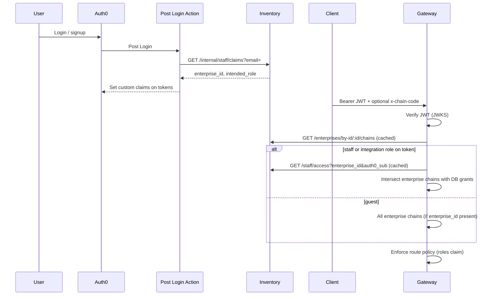
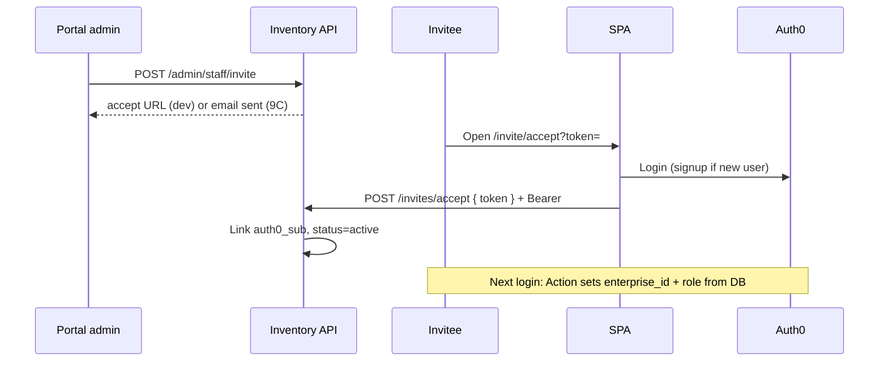

# Authorization and multi-brand access


**Canonical design** for tenancy, roles, and brand scope. Auth0 setup snippets: [`README.md`](../README.md) §2. Implementation phases: [`PHASE9_PLAN.md`](PHASE9_PLAN.md).


**Migrations:** [`0017_enterprise.sql`](../supabase/migrations/0017_enterprise.sql), [`0018_staff_brand_access.sql`](../supabase/migrations/0018_staff_brand_access.sql), **`0019`** (invite + DB roles — Phase **9B**).


---


## Authorization model (decision)


| Layer | Owns | Does not own |

|-------|------|----------------|

| **Auth0** | Identity (`sub`, email), login/MFA/SSO, **global block** (user cannot sign in) | Per-user app roles, brand scope, enterprise membership |

| **Database** (`staff_member`, grants, invites) | **Enterprise**, **intended_role**, brand grants, pending/active lifecycle | JWT verification, HTTP route permission matrix |

| **Post Login Action** | Copy **`enterprise_id`** + **`roles`** from DB onto JWT at login | Business logic; uses inventory internal claims API |

| **Gateway** | Verify JWT, resolve brand scope, enforce route policies from **`roles` claim**, forward headers | Direct SQL |

| **Inventory worker** | Staff/invite CRUD, claims lookup, catalog | Reservation guest scoping |

| **Reservations worker** | Guest bookings by **`x-user-email`**; **`chain_id`** in allowed set | Staff provisioning |


**Per-user Auth0 RBAC assignment is not used** for app permissions. Role names (`guest`, `front_desk`, `manager`, …) still appear on the JWT — the Action sets them from **`staff_member.intended_role`**, not from the Auth0 Dashboard.


**Auth0 remains authoritative for:** sign-up, credentials, MFA, SSO, and **blocking a user account globally** (instant revoke regardless of DB).


**DB remains authoritative for:** enterprise membership, app role, brand scope, in-app disable (`status = disabled`).


---


## Identity provider (Auth0) vs application database


| Auth0 (identity) | Application DB (authorization data) |

|------------------|-------------------------------------|

| Login, MFA, password reset, SSO | Staff rows, invites, brand grants |

| Issuing signed JWTs (`sub`, email) | **`intended_role`**, **`enterprise_id`** (via Action) |

| Block user globally | Disable staff (`status = disabled`) |

| M2M client registration | Integration client grants |


Guests never need a `staff_member` row. Users with staff-like JWT roles but **no** active DB row receive **403** (not provisioned).


### Interim (shipped — until 9B)


Demo/dev still uses a **hardcoded `enterprise_id`** in the Action and **Auth0 RBAC** role assignment per user, plus manual SQL for `auth0_sub`. See [Interim bootstrap](#interim-bootstrap-until-9b).


### Target (Phase 9B+)


No per-user Auth0 Dashboard steps. Invite → login → accept → Action reads DB → JWT has correct **`enterprise_id`** and **`roles`**.


---


## Request flow





**Active brand:** SPA sends **`x-chain-code`** (from `/c/HBR`). Gateway resolves code → UUID and sets **`x-chain-id`** when in scope.


**Caching:** Gateway caches enterprise chains and staff access ~**60 seconds**. Role/grant changes require **re-login** (or token refresh) for JWT role updates; brand grant changes apply within cache TTL without re-login.


**Zero-brand enterprise:** New enterprises have no chains until the admin creates brands. Gateway must allow **empty `x-chain-ids`** for admin, invite, platform, and `/me/chains` routes so the first manager can operate (Phase **9B** gateway change).


---


## Database model


### Enterprise and brands


- **`inventory.enterprise`** — hotel group (code `PLG`). **`active`** column in **9G**.

- **`inventory.chain.enterprise_id`** — each brand belongs to one enterprise.

- Reservations stay **`chain_id`**-scoped.


### Staff (target schema — migration **0019**)


```text

inventory.staff_member

  enterprise_id, email, display_name

  auth0_sub          -- null while pending; set on invite accept

  status             -- pending | active | disabled

  intended_role      -- manager | front_desk | read_only  → copied to JWT by Action

  all_chains         -- true = every brand in enterprise

  active             -- legacy; prefer status (kept for compatibility in 0019)


inventory.staff_invite

  staff_member_id, token_hash, expires_at

  invited_by, accepted_at


inventory.staff_chain_grant

  staff_member_id, chain_id   -- when all_chains = false

```


**Lifecycle:**


| status | auth0_sub | Meaning |

|--------|-----------|---------|

| `pending` | null | Invited; awaiting accept + first login |

| `active` | set | Normal staff |

| `disabled` | set | Revoked in-app; gateway 403 |


### Access rules


| Condition | Result |

|-----------|--------|

| Token role **guest** (no staff row) | All enterprise brands if `enterprise_id` on token; reservations by email |

| Staff role on token, **no** active row / sub mismatch | **403** — not provisioned |

| `status = disabled` or `active = false` | **403** — disabled |

| `all_chains = true` | All enterprise brands |

| `all_chains = false` + grants | Listed `chain_id`s only |

| `all_chains = false`, no grants | **403** — no brands (except admin-only routes when zero brands exist) |


Identity key is JWT **`sub`**, scoped by **`enterprise_id`** on the token.


### Platform operators (Phase **9E**)


Internal ops users: separate table or `staff_member` with a **`platform_operator`** flag / role. Action adds **`platform_operator`** to JWT **`roles`**. Gateway permission **`platform:admin`** on `/v1/inventory/platform/*`.


### M2M integrations


Unchanged: **`integration_client`** + **`integration_chain_grant`**. Credentials Exchange Action sets **`enterprise_id`** (+ optional **`integration`** role).


---


## Invite and accept flow





**Single accept path:** SPA **`POST /invites/accept`** after login. Action does **not** link `auth0_sub` — it only reads claims for tokens.


**Token security:** random token, SHA-256 hash in DB, TTL (e.g. 7 days), single-use, constant-time verify, invite email must match JWT email.


**Email collision:** Same email in two enterprises is allowed. Accept verifies token → staff row → enterprise; Action lookup uses email and returns the **active/pending** staff row (if multiple, prefer accepted invite context — document: one pending invite per email per enterprise).


---


## HTTP surfaces


### Shipped


| Route | Audience | Purpose |

|-------|----------|---------|

| `GET /v1/inventory/staff/access` | Gateway (internal) | Grants by `enterprise_id` + `auth0_sub` / `client_id` |

| `GET /v1/inventory/me/chains` | Authenticated clients | Caller’s allowed brands |

| `GET/POST/PATCH/PUT …/admin/staff` | **Manager** JWT | Staff CRUD (break-glass create with `auth0_sub`) |


### Phase 9B+


| Route | Audience | Purpose |

|-------|----------|---------|

| `POST /v1/inventory/admin/staff/invite` | **Manager** | Pending staff + invite |

| `POST /v1/inventory/invites/accept` | Bearer (invitee) | Link `auth0_sub`, activate |

| `GET /v1/inventory/internal/staff/claims` | Action (secret) | `{ email }` → `{ enterprise_id, roles }` |

| `POST /v1/inventory/platform/enterprises` | **platform_operator** | Create enterprise (no brands) |

| `POST/PATCH /v1/inventory/admin/chains` | **Manager** | Brand CRUD (**9F**) |


Gateway permissions: **`staff:admin`**, **`platform:admin`**. Inventory checks **`x-roles`** from gateway.


Legacy tokens without **`enterprise_id`** may still use **`chain_id`** / **`chain_ids`** claims.


---


## Auth0 Post Login Action (target)


1. Always set **`email`** claim from Auth0 user profile.

2. Call inventory **`GET /internal/staff/claims?email=`** with header **`x-action-secret`**.

3. If response includes staff claims → set **`enterprise_id`** and **`roles: [intended_role]`**.

4. If platform operator → add **`platform_operator`** to roles (or separate branch).

5. Else → **`roles: ["guest"]`**; omit **`enterprise_id`** (public guest booking).


Do **not** read `event.authorization.roles` (Auth0 RBAC) for app permissions.


Do **not** put brand UUIDs in Auth0 metadata.


Snippet and secrets: [`README.md`](../README.md) §2 (updated in **9B**).


---


## Tenant onboarding (target)


See [`PHASE9_PLAN.md`](PHASE9_PLAN.md).


```text

Platform Portal                    Enterprise Admin Portal

─────────────────                  ───────────────────────

Create enterprise (no brands)

Invite first all-chain manager ──► Accept invite → sign in

                                   Create brands

                                   Invite staff (email, role, brands)

```


**No SQL. No Auth0 Dashboard per user.**


### Interim bootstrap (until 9B)


1. Auth0: assign **`manager`** role to user (RBAC).

2. SQL: update **`staff_member.auth0_sub`** after first login.

3. Action: hardcoded demo **`enterprise_id`**.


Remove from ops runbooks once **9B** ships.


---


## Future work (after Phase 9)


| Item | Notes |

|------|--------|

| **Auth0 Organizations** | Enterprise SSO; map IdP groups → `intended_role` in Action |

| **Cache purge** | Immediate effect after admin writes |

| **Grant audit** | `granted_by` on `staff_chain_grant` (`granted_at` exists) |

| **Thin JWT** | Gateway reads role from staff lookup; Action emits only `sub` + `email` |

| **Separate authz service** | See below |

| **Hotel-level ACLs** | Property-scoped permissions |


---


## Separate authorization service?


**Recommendation today: no.** Keep authorization **logic in the gateway** and **grant data in inventory**.


See prior rationale: single front door, tight catalog coupling, small policy surface, low operational cost at current scale.


Extract **`services/authz`** when multiple dimensions (hotel ACLs, delegation, compliance engine) justify a fourth runtime.


---


## Related requirements


| ID | Topic | Status |

|----|-------|--------|

| **FR-Z1** | Route policies from roles claim | Shipped (gateway); **9B** — roles from DB via Action |

| **FR-Z2** | M2M restrictions | Shipped |

| **FR-A3** | Tenant identity | Enterprise + brand scope |

| **FR-Z3** | DB-backed brand grants | Shipped (**0018**) |

| **FR-Z4** | Staff invite + Enterprise Admin | **9B–9D** |

| **FR-Z5** | Platform Portal bootstrap | **9E** |

| **FR-Z6** | Manager brand CRUD | **9F** |


---


## Revision history


| Date | Change |

|------|--------|

| 2026-06-27 | Enterprise model (**0017**), gateway multi-chain, SPA brand filter. |

| 2026-06-27 | Staff brand access (**0018**); admin staff API; Auth0 vs DB split. |

| 2026-06-28 | **DB-driven roles** decision; invite + accept spec; zero-brand gateway; Phase **9B** claims API; deprecate per-user Auth0 RBAC. |


