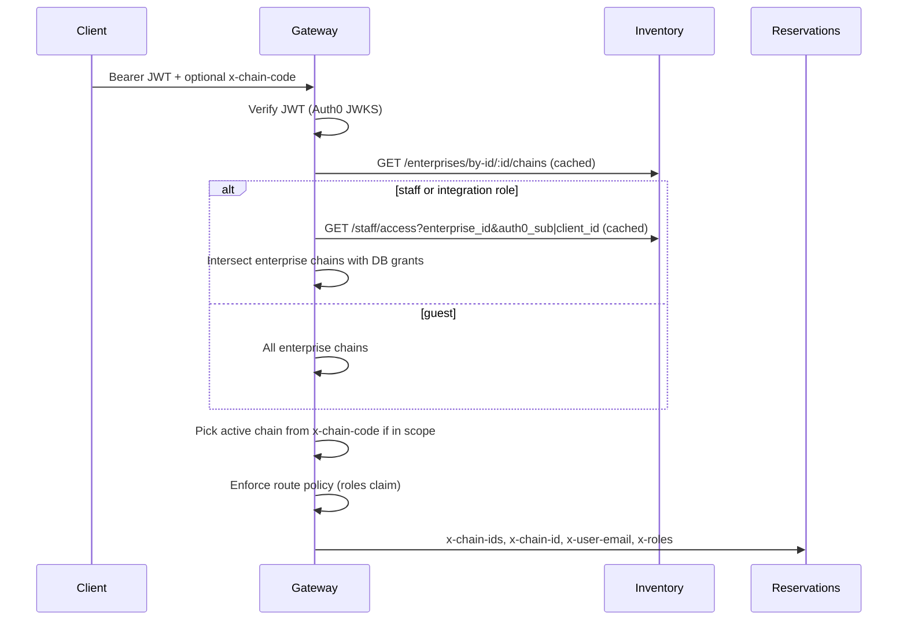

# Authorization and multi-brand access

**Canonical design** for tenancy, roles, and brand scope. Operational setup (Auth0 Action snippet, SQL provisioning) stays in [`README.md`](../README.md) §2; this document explains **why** and **what comes next**.

**Migrations:** [`0017_enterprise.sql`](../supabase/migrations/0017_enterprise.sql), [`0018_staff_brand_access.sql`](../supabase/migrations/0018_staff_brand_access.sql)

---

## Separation of concerns

| Layer | Owns | Does not own |
|-------|------|----------------|
| **Auth0** | Identity (`sub`, email), coarse **roles** (`guest`, `front_desk`, `manager`), **`enterprise_id`** claim | Brand UUID lists, per-user chain grants, hotel-level scope |
| **Database** (`inventory.staff_member`, grants) | **Who** may access **which brands** within an enterprise | JWT verification, HTTP route permission matrix |
| **Gateway** | Verify JWT, resolve brand scope (via inventory), enforce **route policies** from roles, forward **`x-chain-ids`** / **`x-chain-id`** | Direct SQL; workers remain the only DB writers for business data |
| **Inventory worker** | Enterprise catalog, **staff grant lookup** internal API, **`GET /me/chains`** | Reservation guest email scoping |
| **Reservations worker** | Guest “my bookings” filter by **`x-user-email`**; reservation **`chain_id`** in allowed set | Staff provisioning |

## Identity provider (Auth0) vs application database

Authentication and authorization are split on purpose:

| Auth0 (identity) | Application DB (authorization data) |
|------------------|-------------------------------------|
| Login, MFA, password reset, SSO | Staff provisioning (`staff_member`) |
| Issuing signed JWTs (`sub`, email) | Brand grants (`staff_chain_grant`) |
| Coarse **roles** on token (today) | M2M client grants (`integration_client`) |
| Block user globally (cannot log in) | Disable staff in-app (`active = false`) |
| M2M client registration | Which brands an integration may call |

**Today:** roles on the JWT drive the gateway permission matrix; brand scope comes from the DB.

**Future (thin token):** Auth0 Action sets only `sub` + `email` (+ optional `enterprise_id`); `staff_member.role` in the DB replaces Auth0 RBAC for app permissions. Documented in [Future work](#future-work-not-implemented) — not implemented yet.

Guests never need a `staff_member` row. Staff with an Auth0 role but **no** DB row receive **403** (not provisioned).

---

## Current request flow



**Active brand:** SPA sends **`x-chain-code`** (from `/c/HBR`). Gateway resolves code → UUID via inventory and sets **`x-chain-id`** when the brand is in the caller’s allowed set.

**Caching:** Gateway caches enterprise chain lists and staff access lookups for **~60 seconds**. Grant changes propagate without re-login; worst case one cache TTL delay.

---

## Database model

### Enterprise and brands

- **`inventory.enterprise`** — hotel group (e.g. Palladium Lodging Group, code `PLG`).
- **`inventory.chain.enterprise_id`** — each brand belongs to one enterprise.
- Reservation rows stay **`chain_id`**-scoped (no reservation schema change for enterprise listing).

### Staff brand access

```text
inventory.staff_member
  enterprise_id, auth0_sub, email, display_name
  all_chains boolean   -- true = every brand in enterprise (corporate)
  active boolean       -- false = disabled

inventory.staff_chain_grant
  staff_member_id, chain_id   -- used when all_chains = false
```

**Rules:**

| Condition | Result |
|-----------|--------|
| Token role is **guest** | All enterprise brands; reservations filtered by email |
| Staff, **no** `staff_member` row | **403** — not provisioned |
| Staff, `active = false` | **403** — disabled |
| Staff, `all_chains = true` | All enterprise brands |
| Staff, `all_chains = false` + grants | Only listed `chain_id`s |
| Staff, `all_chains = false`, **no** grants | **403** — no brands assigned |

Identity key is JWT **`sub`** (Auth0 subject), scoped by **`enterprise_id`** on the token.

### M2M integrations

Same pattern on separate tables:

- **`inventory.integration_client`** — keyed by Auth0 **`client_id`** / token **`azp`**
- **`inventory.integration_chain_grant`**

Register integrations in the DB; the Credentials Exchange Action only needs **`enterprise_id`** (and optional **`integration`** role).

---

## HTTP surfaces

| Route | Audience | Purpose |
|-------|----------|---------|
| `GET /v1/inventory/staff/access` | Gateway → inventory (internal binding) | Resolve grants by `enterprise_id` + `auth0_sub` or `client_id` |
| `GET /v1/inventory/me/chains` | Authenticated SPA / API clients | Brands the caller may access (after gateway scope resolution) |
| `GET /v1/inventory/enterprises/by-id/:id/chains` | Gateway (internal) | Full brand list for an enterprise |
| `GET /v1/inventory/admin/staff` | **Manager** (Auth0 role) | List provisioned staff for token enterprise |
| `POST /v1/inventory/admin/staff` | **Manager** | Create `staff_member` + optional grants |
| `PATCH /v1/inventory/admin/staff/{id}` | **Manager** | Update email, `auth0_sub`, `active`, `all_chains`, … |
| `PUT /v1/inventory/admin/staff/{id}/chains` | **Manager** | Replace `staff_chain_grant` rows |

Legacy tokens without **`enterprise_id`** may still use **`chain_id`** / **`chain_ids`** claims on the JWT; gateway accepts those for backward compatibility.

### Admin staff API (manager only)

Gateway requires permission **`staff:admin`** (granted only to **`manager`** today). Inventory double-checks **`x-roles`** contains `manager`.

**List staff**

```http
GET /v1/inventory/admin/staff
Authorization: Bearer …
```

**Create staff** — require `email`, `auth0_sub`, and either `all_chains: true` or non-empty `chain_ids`:

```json
{
  "email": "frontdesk@hbr.demo",
  "auth0_sub": "auth0|…",
  "display_name": "Harborline Front Desk",
  "all_chains": false,
  "chain_ids": ["a1111111-1111-4111-8111-111111111111"]
}
```

**Patch staff** — partial update (`active`, `all_chains`, `email`, `auth0_sub`, …).

**Replace brand grants**

```http
PUT /v1/inventory/admin/staff/{id}/chains
{ "chain_ids": ["…"] }
```

Staff access changes take effect within the gateway cache TTL (~60s); no re-login required.

---

## Auth0 (minimal Action)

The Post Login Action sets only:

- **`https://hospitality.app/claims/enterprise_id`**
- **`https://hospitality.app/claims/roles`**
- **`https://hospitality.app/claims/email`** (required for guest reservation scoping)

Do **not** put brand UUIDs or `allowed_chain_codes` in Auth0 metadata — that bypasses the admin portal data model and requires re-login to change access.

---

## Future work (not implemented)

| Item | Target | Notes |
|------|--------|--------|
| **Admin SPA** | Phase 9 UI | Manager UI for staff CRUD; calls admin API above |
| **Roles in DB** | Thin-token migration | `staff_member.role`; Auth0 Action drops `roles` claim |
| **Grant audit** | Migration + admin API | `granted_by`, `granted_at` on `staff_chain_grant` |
| **Invite flow** | Admin SPA | Email invite → user logs in → `auth0_sub` linked automatically |
| **Cache purge** | Gateway | Immediate effect after admin writes (optional `Cache-Control` hook) |
| **Separate authz service** | Scale / compliance | See [Separate authorization service?](#separate-authorization-service) |
| **Hotel-level ACLs** | Advanced RBAC | Property-scoped permissions beyond brand |

---

## Separate authorization service?

**Recommendation today: no.** Keep authorization **logic in the gateway** and **grant data in inventory** (same Supabase project, `inventory` schema).

### Why this is enough for now

1. **Single front door** — All external traffic already goes through the gateway ([**FR-A1**](REQUIREMENTS.md)); workers trust gateway-injected headers, not raw JWTs.
2. **Tight coupling to catalog** — Brand scope is “which `inventory.chain` rows”; inventory already owns enterprise + chain data. A separate service would still call the same tables or duplicate chain metadata.
3. **Small policy surface** — Coarse roles (5 values) + brand allow-list is simple compared to ABAC, delegation, or property-level ACLs.
4. **Operational cost** — Another Worker (deploy, cache, monitoring, failure mode) for little gain at current scale (3 backend services).

### When a dedicated **authz** service *would* make sense

Consider extracting **`services/authz`** (or adopting SpiceDB / OPA) when **several** of these become true:

- **Roles and permissions** live fully in DB with frequent policy changes and audit requirements.
- **Multiple policy dimensions** — hotel-level, rate-plan admin, time-bound access, delegation (“act as front desk for HBR this week”).
- **Non-gateway clients** need the same evaluation (avoid — keep gateway as PEP).
- **Policy-as-code** owned by a separate team or compliance requires a standard engine (Cedar, Rego).
- **Inventory service** grows too large; you want a clear bounded context for “access control” CRUD and evaluation APIs.

### Middle ground (before a full authz service)

If grant CRUD grows but evaluation stays simple:

1. Add **`/v1/admin/*`** routes on **inventory** (or a thin **admin** worker).
2. Keep **`GET /staff/access`** as the single evaluation read for the gateway.
3. Optionally move **`authorization.ts`** route matrix into a shared npm package consumed by gateway only.

That preserves one evaluation path without a fourth runtime on every request.

### Target architecture if you extract later

```text
Client → Gateway (JWT verify, PEP)
              → Authz service: ResolveAccess(enterprise_id, sub, roles) → { chain_ids, permissions }
              → Inventory / Reservations (trust headers)
```

Grant tables could move to an **`auth`** schema or authz service DB; gateway cache TTL and API shape stay the same.

---

## Related requirements

| ID | Topic | Status |
|----|-------|--------|
| **FR-Z1** | Route policies from roles claim | Shipped (gateway) |
| **FR-Z2** | M2M restrictions | Shipped (gateway + `integration_client`) |
| **FR-A3** | Tenant identity | **Updated** — enterprise + brand scope (see §1.1 note in REQUIREMENTS) |
| **FR-Z3** *(proposed)* | DB-backed staff brand grants | Shipped (**0018**) |
| **FR-Z4** | Admin staff / grant CRUD | **API shipped** (`/v1/inventory/admin/staff`); admin SPA backlog |

---

## Revision history

| Date | Change |
|------|--------|
| 2026-06-27 | Enterprise model (**0017**), gateway multi-chain forwarding, SPA brand filter. |
| 2026-06-27 | Staff brand access in DB (**0018**); removed Auth0 `allowed_chain_codes`; `GET /me/chains`. |
| 2026-06-27 | Manager **admin staff API**; `staff:admin` permission; Auth0 vs DB split documented. |
